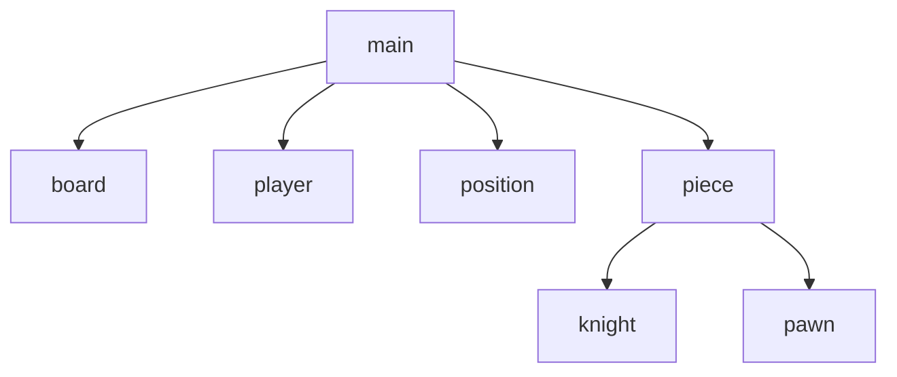

# Java Bad Chees
a bad chess cli game made in java as practice

File Structure

```mermaid
graph TD;
    main-->board;
    main-->player;
    main-->position;
    main-->piece;
    piece-->knight;
    piece-->pawn;
```

## To-Do

- [ ] complete the project
- [x] beans
___

> [!WARNING]
> Very Low Quality!
